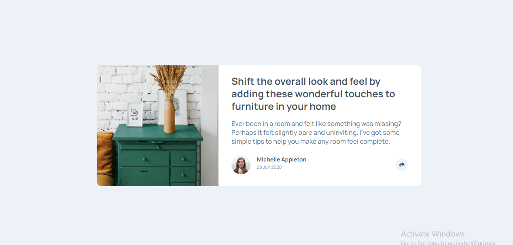

# Frontend Mentor - Article preview component solution

This is a solution to the [Article preview component challenge on Frontend Mentor](https://www.frontendmentor.io/challenges/article-preview-component-dYBN_pYFT). Frontend Mentor challenges help you improve your coding skills by building realistic projects.

## Table of contents

- [Overview](#overview)
  - [The challenge](#the-challenge)
  - [Screenshot](#screenshot)
  - [Links](#links)
- [My process](#my-process)
  - [Built with](#built-with)
  - [What I learned](#what-i-learned)
  - [Useful resources](#useful-resources)
- [Author](#author)

## Overview

### The challenge

Users should be able to:

- View the optimal layout for the component depending on their device's screen size
- See the social media share links when they click the share icon

### Screenshot



### Links

- Solution URL: [GitHub](https://github.com/Emmanuel-obiora/article-preview-component)
- Live Site URL: [Live site](https://emmanuel-obiora.github.io/article-preview-component/)

## My process

### Built with

- Semantic HTML5 markup
- CSS custom properties
- Flexbox
- CSS Grid

### What I learned

Use this section to recap over some of your major learnings while working through this project. Writing these out and providing code samples of areas you want to highlight is a great way to reinforce your own knowledge.

To see how you can add code snippets, see below:

```css
.proud-of-this-css {
    border-right: 10px solid transparent;
    border-left: 10px solid transparent;
    border-top: 10px solid var(--VeryDarkGrayishBlue);
}
```

### Useful resources

- [Creating a triangle from a div](https://www.geeksforgeeks.org/how-to-create-triangle-in-css/) - This helped me in styling a triangle using css properties.

## Author

- Website - [Obiora Emmanuel](https://emmanuel-obiora.github.io/portfolio-about-me-/web-content)
- Frontend Mentor - [@Emmanuel-obiora](https://www.frontendmentor.io/profile/Emmanuel-obiora)
- Twitter - [@Miroclesdgenius](https://twitter.com/Miroclesdgenius)
